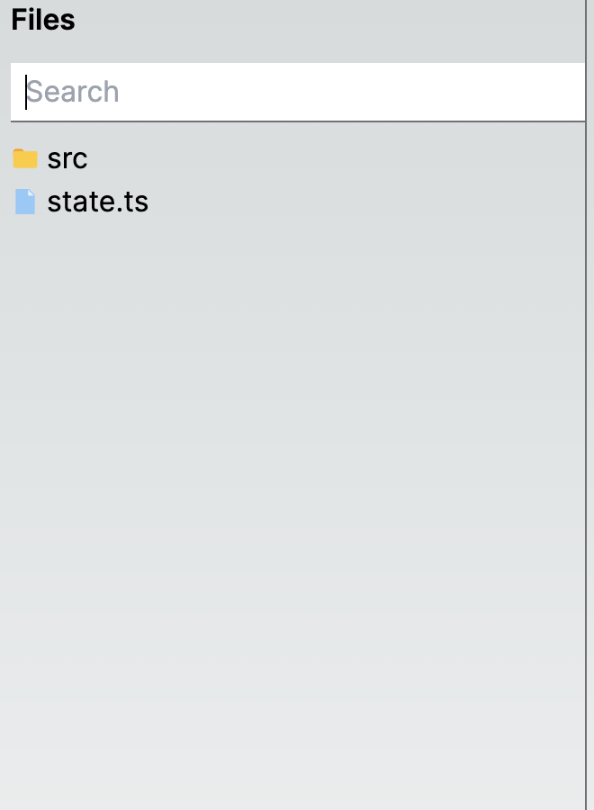

This is a demo of the file explorer sidebar:

- when you click the icon or the name of the file or folder, you can see breadcrumbs above the file explorer.

- when you click on a file, the full path to the file is logged in the console.

- when you start typing into the search input, you get files that contain the input string as their name's substring. If you clear the input, you get the tree in the previous state.

## Getting Started

First, install dependencies and run the development server:

```bash
npm install
npm run dev
```

Open [http://localhost:3000](http://localhost:3000) with your browser to see the result.

## Screenshots

  
